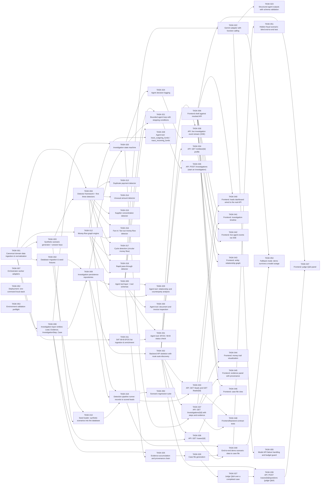

# Backlog

> Generated by `scripts/orchestration/seed_backlog.py` from
> `orchestrator/task_queue/backlog.py`. **Do not edit this file by hand** --
> edit the backlog module and re-run the seeder, or the mirror and the
> GitHub queue drift apart.

55 tasks. GitHub issues are the source of truth for state and
claims (ADR-0003); this file and `tasks/*/TASK-*.md` are the mirror.

## Startable right now

No unmet dependencies, so a worker can claim these immediately:
`TASK-001`, `TASK-006`, `TASK-052`, `TASK-053`

"Depth" below is how many dependency hops precede a task -- depth 0 is
claimable now, and the highest depth on a P0 task is the critical path
to the demo.

## Tasks

| Task | P | Area | Depends on | Depth | Title |
|---|---|---|---|---|---|
| TASK-001 | P0 | data | - | 0 | Canonical domain data ingestion & normalization |
| TASK-002 | P0 | database | TASK-001 | 1 | Database migration & seed fixtures |
| TASK-003 | P0 | data | TASK-001 | 1 | Synthetic scenario generator + answer keys |
| TASK-004 | P0 | detection | TASK-001, TASK-003 | 2 | Detector framework + first three detectors |
| TASK-005 | P0 | agent | TASK-009 | 3 | Agent tool layer + tool schemas |
| TASK-006 | P0 | frontend | - | 0 | Frontend shell against mocked API |
| TASK-007 | P0 | orchestrator | - | 0 | Orchestrator worker adapters |
| TASK-008 | P0 | backend | TASK-001 | 1 | Investigation-layer entities: Lead, Evidence, InvestigationStep, Case |
| TASK-009 | P0 | backend | TASK-002, TASK-008 | 2 | Investigation persistence repositories |
| TASK-010 | P0 | data | TASK-002, TASK-003 | 2 | Seed loader: synthetic scenarios into the database |
| TASK-011 | P1 | data | TASK-001 | 1 | SAT 69-B EFOS list ingestion & enrichment |
| TASK-012 | P0 | graph | TASK-001 | 1 | Money-flow graph engine |
| TASK-013 | P0 | detection | TASK-004 | 3 | Duplicate payment detector |
| TASK-014 | P1 | detection | TASK-004 | 3 | Unusual amount detector |
| TASK-015 | P1 | detection | TASK-004 | 3 | Supplier concentration detector |
| TASK-016 | P0 | graph | TASK-004, TASK-012 | 3 | Fan-in / fan-out money-flow detector |
| TASK-017 | P0 | graph | TASK-004, TASK-012 | 3 | Cycle detection (circular money flow) |
| TASK-018 | P1 | graph | TASK-004, TASK-012 | 3 | Rapid pass-through detector |
| TASK-019 | P0 | detection | TASK-004, TASK-009, TASK-010 | 3 | Detection pipeline runner: records to scored leads |
| TASK-020 | P0 | agent | TASK-008, TASK-009 | 3 | Investigation state machine |
| TASK-021 | P0 | agent | TASK-005, TASK-020 | 4 | Bounded agent loop with stopping conditions |
| TASK-022 | P0 | agent | TASK-005 | 4 | Gemini adapter with function calling |
| TASK-023 | P0 | agent | TASK-022 | 5 | Structured agent outputs with schema validation |
| TASK-024 | P0 | agent | TASK-020 | 4 | Agent decision logging |
| TASK-025 | P0 | evidence | TASK-008, TASK-005 | 4 | Evidence accumulation and provenance chain |
| TASK-026 | P0 | agent | TASK-025 | 5 | Case file generation |
| TASK-027 | P1 | agent | TASK-026 | 6 | Judge Q&A over a completed case |
| TASK-028 | P0 | agent | TASK-005, TASK-012 | 4 | Agent tool: trace_outgoing_funds / trace_incoming_funds |
| TASK-029 | P0 | agent | TASK-005, TASK-012 | 4 | Agent tool: relationship and counterparty analysis |
| TASK-030 | P0 | agent | TASK-005 | 4 | Agent tool: document and invoice inspection |
| TASK-031 | P1 | agent | TASK-005, TASK-011 | 4 | Agent tool: EFOS / 69-B status check |
| TASK-032 | P0 | backend | TASK-009 | 3 | Backend API skeleton with route auto-discovery |
| TASK-033 | P0 | backend | TASK-032, TASK-019 | 4 | API: GET /leads and GET /leads/{id} |
| TASK-034 | P1 | backend | TASK-032 | 4 | API: GET /entities/{id} profile |
| TASK-035 | P0 | backend | TASK-032, TASK-021 | 5 | API: POST /investigations (start an investigation) |
| TASK-036 | P0 | backend | TASK-032, TASK-008 | 4 | API: GET /cases/{id} |
| TASK-037 | P0 | backend | TASK-032, TASK-020 | 4 | API: GET /investigations/{id} with steps and evidence |
| TASK-038 | P0 | backend | TASK-032, TASK-024 | 5 | API: live investigation event stream (SSE) |
| TASK-039 | P1 | backend | TASK-032, TASK-027 | 7 | API: POST /cases/{id}/questions (judge Q&A) |
| TASK-040 | P0 | frontend | TASK-006, TASK-033 | 5 | Frontend: leads dashboard wired to the real API |
| TASK-041 | P0 | frontend | TASK-006, TASK-037 | 5 | Frontend: investigation timeline |
| TASK-042 | P0 | frontend | TASK-006, TASK-038 | 6 | Frontend: live agent events via SSE |
| TASK-043 | P0 | frontend | TASK-006, TASK-034 | 5 | Frontend: entity relationship graph |
| TASK-044 | P0 | frontend | TASK-006, TASK-037 | 5 | Frontend: money trail visualization |
| TASK-045 | P0 | frontend | TASK-006, TASK-037 | 5 | Frontend: evidence panel with provenance |
| TASK-046 | P0 | frontend | TASK-006, TASK-036 | 5 | Frontend: case file view |
| TASK-047 | P1 | frontend | TASK-006, TASK-039 | 8 | Frontend: judge Q&A panel |
| TASK-048 | P1 | backend | TASK-033, TASK-037 | 5 | Frontend/backend contract tests |
| TASK-049 | P0 | backend | TASK-019, TASK-026, TASK-036 | 6 | End-to-end demo scenario: data to case file |
| TASK-050 | P1 | detection | TASK-019 | 4 | Scenario regression suite |
| TASK-051 | P1 | detection | TASK-049 | 7 | Hidden fraud scenario: blind end-to-end test |
| TASK-052 | P1 | infra | - | 0 | Deployment: one-command local stack |
| TASK-053 | P1 | infra | - | 0 | Environment validation preflight |
| TASK-054 | P1 | infra | TASK-022, TASK-049 | 7 | Fallback mode: demo survives a model outage |
| TASK-055 | P1 | agent | TASK-022 | 5 | Model API failure handling and budget guard |

## Dependency graph

